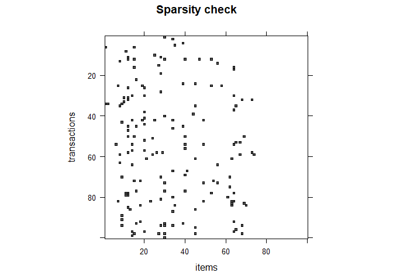
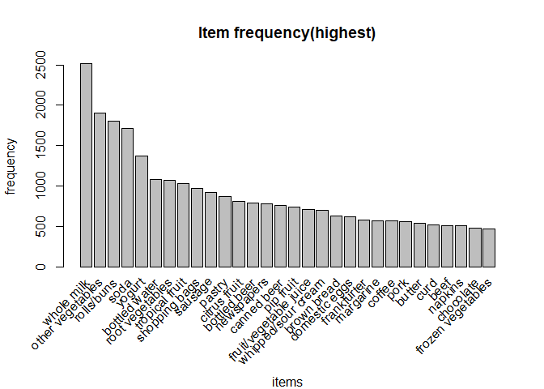
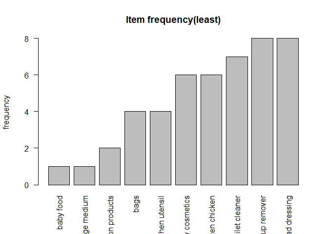
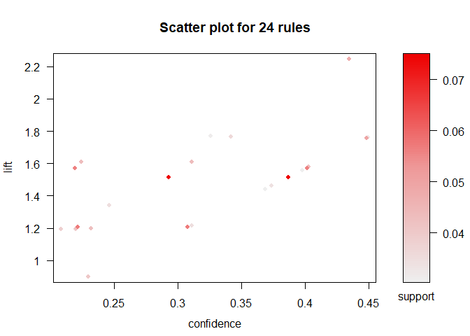
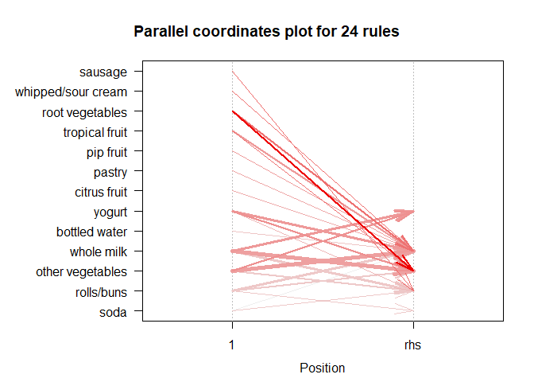

Market\_basket
================

``` r
groceries <- read.csv("~/Downloads/Datasets/Groceries.csv")
library(arules)
library(arulesViz)

groceries$Item.s.<-NULL

#saving file
write.csv(groceries,file="groc.csv",row.names = FALSE)


trac<- read.transactions("~/groc.csv",sep = ",")


trac<-trac[-1,]
```

\#inspecting first 5 transactions

``` r
inspect(head(trac[1:5,]))
```

    ##     items                     
    ## [1] {citrus fruit,            
    ##      margarine,               
    ##      ready soups,             
    ##      semi-finished bread}     
    ## [2] {coffee,                  
    ##      tropical fruit,          
    ##      yogurt}                  
    ## [3] {whole milk}              
    ## [4] {cream cheese,            
    ##      meat spreads,            
    ##      pip fruit,               
    ##      yogurt}                  
    ## [5] {condensed milk,          
    ##      long life bakery product,
    ##      other vegetables,        
    ##      whole milk}

``` r
image(trac[1:100,1:100],xlab="items",ylab="transactions",main="Sparsity check")   
```

<!-- -->

how sparse the data is (high)^

``` r
summary(trac)
```

    ## transactions as itemMatrix in sparse format with
    ##  9835 rows (elements/itemsets/transactions) and
    ##  201 columns (items) and a density of 0.02193759 
    ## 
    ## most frequent items:
    ##       whole milk other vegetables       rolls/buns             soda 
    ##             2513             1903             1809             1715 
    ##           yogurt          (Other) 
    ##             1372            34055 
    ## 
    ## element (itemset/transaction) length distribution:
    ## sizes
    ##    1    2    3    4    5    6    7    8    9   10   11   12   13   14   15   16 
    ## 2159 1643 1299 1005  855  645  545  438  350  246  182  117   78   77   55   46 
    ##   17   18   19   20   21   22   23   24   26   27   28   29   32 
    ##   29   14   14    9   11    4    6    1    1    1    1    3    1 
    ## 
    ##    Min. 1st Qu.  Median    Mean 3rd Qu.    Max. 
    ##   1.000   2.000   3.000   4.409   6.000  32.000 
    ## 
    ## includes extended item information - examples:
    ##             labels
    ## 1 abrasive cleaner
    ## 2 artif. sweetener
    ## 3   baby cosmetics

``` r
rules<-apriori(trac,parameter = list(supp=0.02,conf=0.02,minlen=2,target="frequent itemsets"))
```

    ## Apriori
    ## 
    ## Parameter specification:
    ##  confidence minval smax arem  aval originalSupport maxtime support minlen
    ##          NA    0.1    1 none FALSE            TRUE       5    0.02      2
    ##  maxlen            target  ext
    ##      10 frequent itemsets TRUE
    ## 
    ## Algorithmic control:
    ##  filter tree heap memopt load sort verbose
    ##     0.1 TRUE TRUE  FALSE TRUE    2    TRUE
    ## 
    ## Absolute minimum support count: 196 
    ## 
    ## set item appearances ...[0 item(s)] done [0.00s].
    ## set transactions ...[169 item(s), 9835 transaction(s)] done [0.00s].
    ## sorting and recoding items ... [59 item(s)] done [0.00s].
    ## creating transaction tree ... done [0.00s].
    ## checking subsets of size 1 2 3 done [0.00s].
    ## sorting transactions ... done [0.00s].
    ## writing ... [63 set(s)] done [0.00s].
    ## creating S4 object  ... done [0.00s].

``` r
inspect(head(sort(rules,by="support"),10))
```

    ##      items                              support    transIdenticalToItemsets
    ## [1]  {other vegetables,whole milk}      0.07483477 0.0009150991            
    ## [2]  {rolls/buns,whole milk}            0.05663447 0.0020335536            
    ## [3]  {whole milk,yogurt}                0.05602440 0.0010167768            
    ## [4]  {root vegetables,whole milk}       0.04890696 0.0007117438            
    ## [5]  {other vegetables,root vegetables} 0.04738180 0.0009150991            
    ## [6]  {other vegetables,yogurt}          0.04341637 0.0004067107            
    ## [7]  {other vegetables,rolls/buns}      0.04260295 0.0012201322            
    ## [8]  {tropical fruit,whole milk}        0.04229792 0.0009150991            
    ## [9]  {soda,whole milk}                  0.04006101 0.0014234875            
    ## [10] {rolls/buns,soda}                  0.03833249 0.0034570412            
    ##      count
    ## [1]  736  
    ## [2]  557  
    ## [3]  551  
    ## [4]  481  
    ## [5]  466  
    ## [6]  427  
    ## [7]  419  
    ## [8]  416  
    ## [9]  394  
    ## [10] 377

Since whole milk is the most frequent item set in this dataset, I would
to find what item is bought together with whole milk.

``` r
rules<-apriori(trac,parameter = list(supp=0.02,conf=0.02,minlen=2,target="rules"),appearance =list(rhs="whole milk",default="lhs"))
```

    ## Apriori
    ## 
    ## Parameter specification:
    ##  confidence minval smax arem  aval originalSupport maxtime support minlen
    ##        0.02    0.1    1 none FALSE            TRUE       5    0.02      2
    ##  maxlen target  ext
    ##      10  rules TRUE
    ## 
    ## Algorithmic control:
    ##  filter tree heap memopt load sort verbose
    ##     0.1 TRUE TRUE  FALSE TRUE    2    TRUE
    ## 
    ## Absolute minimum support count: 196 
    ## 
    ## set item appearances ...[1 item(s)] done [0.00s].
    ## set transactions ...[169 item(s), 9835 transaction(s)] done [0.01s].
    ## sorting and recoding items ... [59 item(s)] done [0.00s].
    ## creating transaction tree ... done [0.00s].
    ## checking subsets of size 1 2 3 done [0.00s].
    ## writing ... [27 rule(s)] done [0.00s].
    ## creating S4 object  ... done [0.00s].

``` r
inspect(head(sort(rules,by="support"),10))
```

    ##      lhs                     rhs          support    confidence coverage  
    ## [1]  {other vegetables}   => {whole milk} 0.07483477 0.3867578  0.19349263
    ## [2]  {rolls/buns}         => {whole milk} 0.05663447 0.3079049  0.18393493
    ## [3]  {yogurt}             => {whole milk} 0.05602440 0.4016035  0.13950178
    ## [4]  {root vegetables}    => {whole milk} 0.04890696 0.4486940  0.10899847
    ## [5]  {tropical fruit}     => {whole milk} 0.04229792 0.4031008  0.10493137
    ## [6]  {soda}               => {whole milk} 0.04006101 0.2297376  0.17437722
    ## [7]  {bottled water}      => {whole milk} 0.03436706 0.3109476  0.11052364
    ## [8]  {pastry}             => {whole milk} 0.03324860 0.3737143  0.08896797
    ## [9]  {whipped/sour cream} => {whole milk} 0.03223183 0.4496454  0.07168277
    ## [10] {citrus fruit}       => {whole milk} 0.03050330 0.3685504  0.08276563
    ##      lift      count
    ## [1]  1.5136341 736  
    ## [2]  1.2050318 557  
    ## [3]  1.5717351 551  
    ## [4]  1.7560310 481  
    ## [5]  1.5775950 416  
    ## [6]  0.8991124 394  
    ## [7]  1.2169396 338  
    ## [8]  1.4625865 327  
    ## [9]  1.7597542 317  
    ## [10] 1.4423768 300

frequency of items with other items

``` r
tbl<-crossTable(trac,sort=TRUE)
tbl[1:7,1:7]
```

    ##                  whole milk other vegetables rolls/buns soda yogurt
    ## whole milk             2513              736        557  394    551
    ## other vegetables        736             1903        419  322    427
    ## rolls/buns              557              419       1809  377    338
    ## soda                    394              322        377 1715    269
    ## yogurt                  551              427        338  269   1372
    ## bottled water           338              244        238  285    226
    ## root vegetables         481              466        239  183    254
    ##                  bottled water root vegetables
    ## whole milk                 338             481
    ## other vegetables           244             466
    ## rolls/buns                 238             239
    ## soda                       285             183
    ## yogurt                     226             254
    ## bottled water             1087             154
    ## root vegetables            154            1072

visualizing the items(top 30 items)

``` r
itemFrequencyPlot(trac,type="absolute",topN=30,ylab="frequency",xlab="items",main="Item frequency(highest)") 
```

<!-- -->

least frequent items

``` r
barplot(sort(table(unlist(LIST(trac))))[1:10],las=2,ylab="frequency",main="Item frequency(least)")
```

<!-- -->

sorting by highest lift values

``` r
rules<-apriori(trac,parameter = list(supp=0.03,conf=0.2,minlen=2,target="rules"))
```

    ## Apriori
    ## 
    ## Parameter specification:
    ##  confidence minval smax arem  aval originalSupport maxtime support minlen
    ##         0.2    0.1    1 none FALSE            TRUE       5    0.03      2
    ##  maxlen target  ext
    ##      10  rules TRUE
    ## 
    ## Algorithmic control:
    ##  filter tree heap memopt load sort verbose
    ##     0.1 TRUE TRUE  FALSE TRUE    2    TRUE
    ## 
    ## Absolute minimum support count: 295 
    ## 
    ## set item appearances ...[0 item(s)] done [0.00s].
    ## set transactions ...[169 item(s), 9835 transaction(s)] done [0.00s].
    ## sorting and recoding items ... [44 item(s)] done [0.00s].
    ## creating transaction tree ... done [0.00s].
    ## checking subsets of size 1 2 3 done [0.00s].
    ## writing ... [25 rule(s)] done [0.00s].
    ## creating S4 object  ... done [0.00s].

``` r
rules<-sort(rules,by="lift")
inspect(head(rules[-2],10))            #"-2" to remove a redundant rule
```

    ##      lhs                     rhs                support    confidence
    ## [1]  {root vegetables}    => {other vegetables} 0.04738180 0.4347015 
    ## [2]  {sausage}            => {rolls/buns}       0.03060498 0.3257576 
    ## [3]  {tropical fruit}     => {other vegetables} 0.03589222 0.3420543 
    ## [4]  {whipped/sour cream} => {whole milk}       0.03223183 0.4496454 
    ## [5]  {root vegetables}    => {whole milk}       0.04890696 0.4486940 
    ## [6]  {yogurt}             => {other vegetables} 0.04341637 0.3112245 
    ## [7]  {other vegetables}   => {yogurt}           0.04341637 0.2243826 
    ## [8]  {tropical fruit}     => {whole milk}       0.04229792 0.4031008 
    ## [9]  {yogurt}             => {whole milk}       0.05602440 0.4016035 
    ## [10] {whole milk}         => {yogurt}           0.05602440 0.2192598 
    ##      coverage   lift     count
    ## [1]  0.10899847 2.246605 466  
    ## [2]  0.09395018 1.771048 301  
    ## [3]  0.10493137 1.767790 353  
    ## [4]  0.07168277 1.759754 317  
    ## [5]  0.10899847 1.756031 481  
    ## [6]  0.13950178 1.608457 427  
    ## [7]  0.19349263 1.608457 427  
    ## [8]  0.10493137 1.577595 416  
    ## [9]  0.13950178 1.571735 551  
    ## [10] 0.25551601 1.571735 551

``` r
rules<-rules[-2]
plot(rules,measure=c("confidence","lift"),shading = "support",method = "scatterplot")
```

<!-- -->

``` r
plot(rules,method = "paracoord")
```

<!-- -->

From this plot we can see that rolls/buns ,other vegetables and whole
milk are likely bought when other items are bought.
